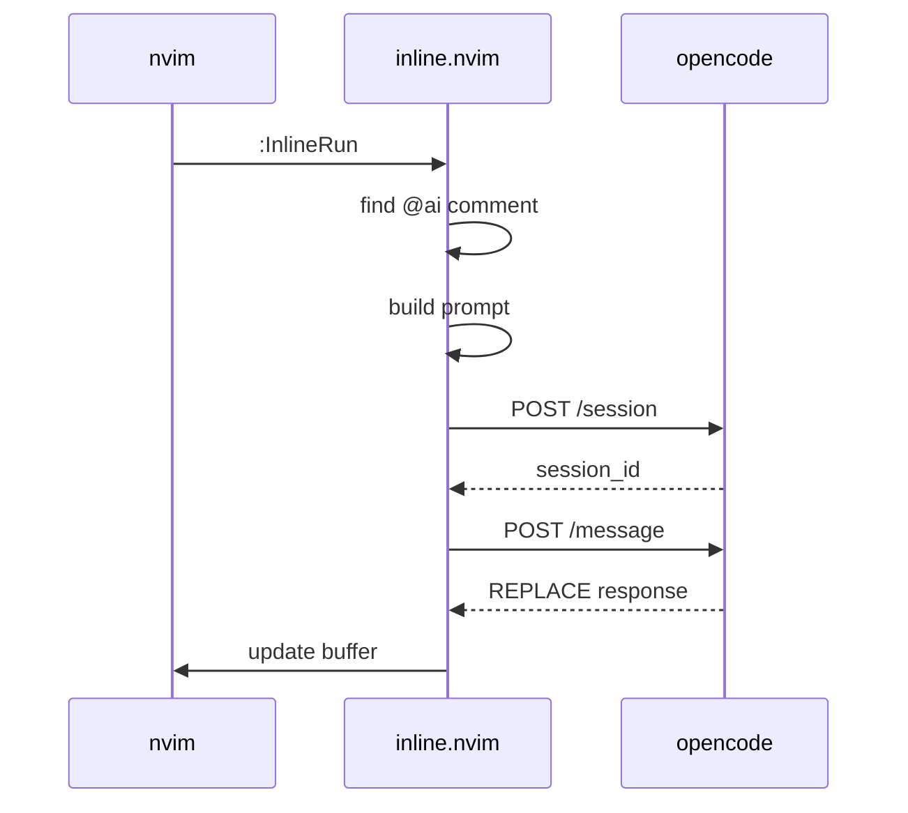

# inline.nvim

> **Note**: This is an experimental plugin, not intended for production use. If you want something featureful and actively maintained, use [avante.nvim](https://github.com/yetone/avante.nvim) or [CodeCompanion](https://github.com/olimorris/codecompanion.nvim). This exists as a learning project and a starting point if you want to build your own.

Simple inline code generation plugin for [nvim](https://neovim.io), which uses [OpenCode](https://opencode.ai) as a backend.

## How-To: Use

- Annotate your code with an instruction `// @ai <instruction>` comment in your code, trigger the plugin with `:InlineRun`, and the plugin will replace it with the OpenCode response.


## Why

- I wanted to build my first [nvim](https://neovim.io) plugin.
- I wanted the same model-agnostic, on-demand workflow from [OpenCode](https://opencode.ai) *inside* the editor.
- Intentionally minimal: no always-on features, no inline completion—just a lightweight tool to help form a clearer mental model of the codebase.

## How



## Requirements

- I tested this with nvim `v0.11.1` and OpenCode `v1.0.205`.
- You want to have [OpenCode](https://opencode.ai) server running (`opencode serve --port 4096`) -- or in a custom port.

## Installation

### lazy.nvim

```lua
{
  "haapjari/inline.nvim",
  config = function()
    require("inline").setup({
      -- optional: override provider/model (defaults to OpenCode's config)
      -- provider = "anthropic",
      -- model = "claude-sonnet-4-5",
      -- per-filetype agent mapping
      agents = {
        go = "go", -- this is my custom agent, you can omit this entirely
      },
    })
  end,
  keys = {
    { "<leader>ai", "<cmd>InlineRun<cr>", desc = "run inline ai" },
  },
  cmd = { "InlineRun", "InlineStatus", "InlineConfig", "InlineCancel" },
}
```

## Configuration

```lua
require("inline").setup({
  -- OpenCode server details
  host = "127.0.0.1",  -- default
  port = 4096,         -- default
  
  -- model (optional - uses OpenCode's configured defaults if omitted)
  provider = "anthropic",
  model = "claude-sonnet-4-5",
  
  -- default agent
  agent = "build",  -- default
  
  -- per-filetype agent mapping
  agents = {
    go = "go",
    python = "python",
  },
  
  -- keymap (false to disable, string to customize)
  keymap = "<leader>ai",  -- default
  
  -- custom prompt template (nil uses built-in default)
  prompt = "~/.config/nvim/my-inline-prompt.md",
})
```

## Custom Prompt

- You can customize the prompt by pointing to a markdown file:

```lua
require("inline").setup({
  prompt = "~/.config/nvim/prompt.md",
})
```

The prompt uses `%s` placeholders (in order):

1. filename
2. filetype
3. buffer content (with line numbers)
4. line number of @ai comment
5. instruction text

- See: `prompts/default.md` for the default template.

## Commands

| Command                   | Description                                           |
|---------------------------|-------------------------------------------------------|
| `:InlineRun`              | run ai for the nearest @ai comment                    |
| `:InlineRun agent=<name>` | override default or configured agent for this request |
| `:InlineStatus`           | check opencode server status                          |
| `:InlineConfig`           | show current configuration                            |
| `:InlineCancel`           | cancel current request                                |

## Supported Comment Formats 

- The plugin automatically detects your language's comment syntax using vim's `commentstring` option. The `commentstring` setting (see [`:help commentstring`](https://neovim.io/doc/user/options.html#'commentstring')) defines the format for comments in each filetype, allowing the plugin to recognize `@ai` directives regardless of language:

| Language | Format |
|----------|--------|
| Go, C, JS, TS | `// @ai ...` |
| Python, Bash | `# @ai ...` |
| Lua | `-- @ai ...` |

## Features

- Non-Blocking Requests.
- Smart Range Detection.
- Spinner Animation.
- Multiple Concurrent Requests.
- Buffer Change Detection - you can edit your file at the same time, while ai is processing.
- Custom Prompt Templates.

## License

MIT.
