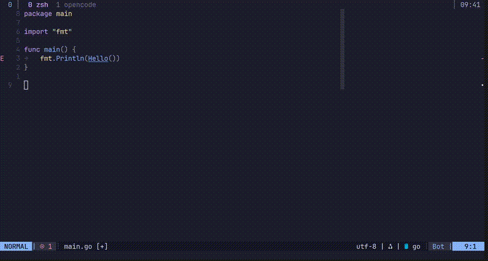
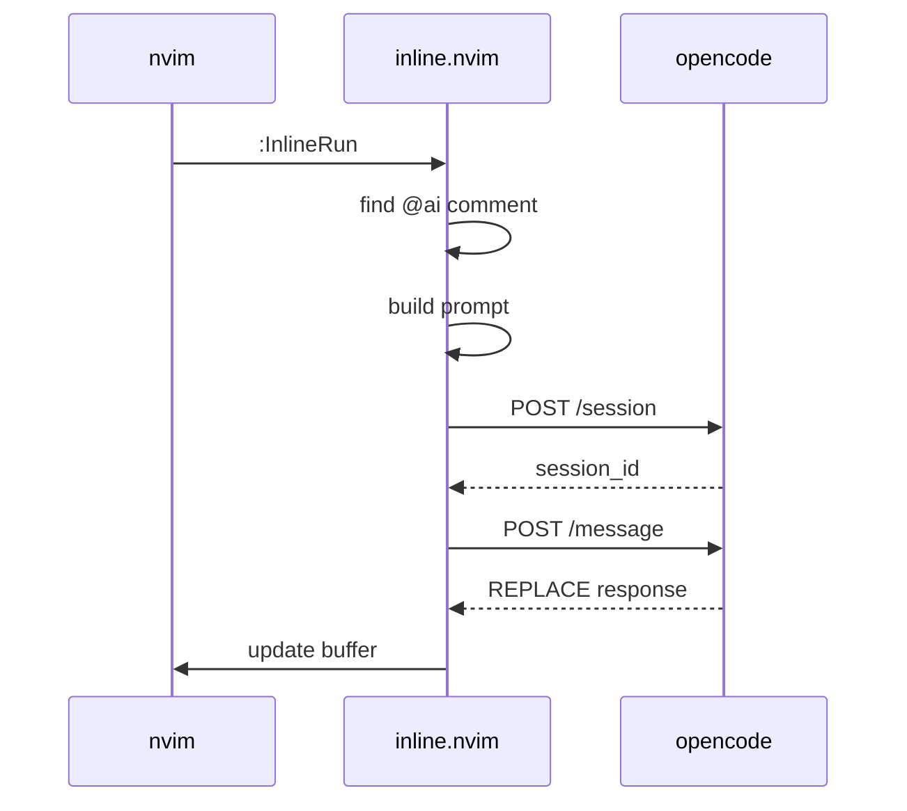
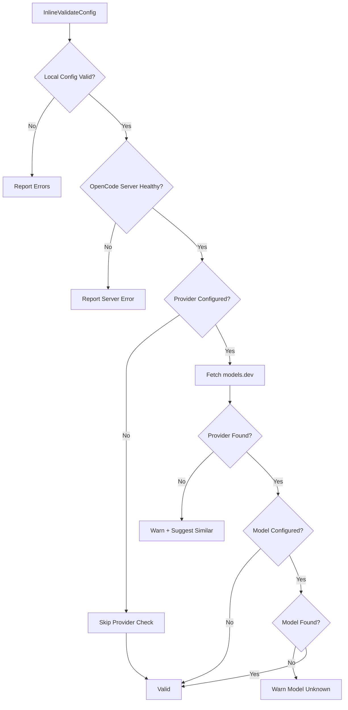

# inline.nvim

[](https://github.com/haapjari/inline.nvim/releases)
[](LICENSE)

> **Note**: This is an experimental plugin, not intended for production use. If you want something featureful and actively maintained, use [avante.nvim](https://github.com/yetone/avante.nvim) or [CodeCompanion](https://github.com/olimorris/codecompanion.nvim). This exists as a learning project and a starting point if you want to build your own.

Simple inline code generation plugin for [nvim](https://neovim.io), which uses [OpenCode](https://opencode.ai) as a backend.

## Scope

This plugin is designed for **single-buffer, in-place edits**:

- Generate a function from a signature
- Add documentation or comments
- Fix a bug in a specific block
- Refactor a small section of code

It is **not** intended for:

- Multi-file refactoring
- Large-scale codebase changes
- Complex implementations spanning multiple files

For those use cases, use [OpenCode](https://opencode.ai) directly, your editor's refactoring tools, or other agentic coding assistants.

## How-To: Use

- Annotate your code with an instruction `// @ai <instruction>` comment in your code, trigger the plugin with `:InlineRun`, and the plugin will replace it with the OpenCode response.



## Why

- I wanted to build my first [nvim](https://neovim.io) plugin.
- I wanted the same model-agnostic, on-demand workflow from [OpenCode](https://opencode.ai) *inside* the editor.
- Intentionally minimal: no always-on features, no inline completion—just a lightweight tool to help form a clearer mental model of the codebase.

## How



## Requirements

- I tested this with nvim `v0.11.1` and OpenCode `v1.0.223`.
- You want to have [OpenCode](https://opencode.ai) server running (`opencode serve --port 4096`) -- or in a custom port.

## Installation

### lazy.nvim

```lua
{
  "haapjari/inline.nvim",
  config = function()

      -- optional: override provider/model (defaults to OpenCode's config)
      -- provider = "anthropic",
      -- model = "claude-sonnet-4-5",
      -- per-filetype agent mapping
      agents = {
        go = "go", -- this is my custom agent, you can omit this entirely
      },
    })
  end,
  keys = {
    { "<leader>ai", "<cmd>InlineRun<cr>", desc = "run inline ai" },
  },
  cmd = { "InlineRun", "InlineStatus", "InlineConfig", "InlineCancel", "InlineValidateConfig" },
}
```

### Pinning to a Version

If you encounter issues with a new release, you can pin to a specific version:

```lua
{
  "haapjari/inline.nvim",
  tag = "v0.0.1",  -- pin to specific version
  -- or: commit = "abc123",  -- pin to specific commit
  config = function()
    require("inline").setup({})
  end,
}
```

## Configuration

```lua
require("inline").setup({
  -- OpenCode server details
  host = "127.0.0.1",  -- default
  port = 4096,         -- default
  
  -- model (optional - uses OpenCode's configured defaults if omitted)
  provider = "anthropic",
  model = "claude-sonnet-4-5",
  
  -- default agent (used when no filetype mapping matches)
  agent = "build",  -- default
  
  -- per-filetype agent mapping (see "Agents" section below)
  agents = {
    go = "go",
    python = "python",
  },
  
  -- keymap (false to disable, string to customize)
  keymap = "<leader>ai",  -- default
  
  -- custom prompt template (nil uses built-in default)
  prompt = "~/.config/nvim/my-inline-prompt.md",
})
```

## Agents

> **Note**: Agent configuration is entirely optional. If you omit the `agents` table, all requests use the default `build` agent which works out of the box.

The `agents` table maps `nvim` filetypes to OpenCode agent names. When you run `:InlineRun`, the plugin checks the current buffer's filetype and uses the corresponding agent.

```lua
agents = {
  go = "go",         -- *.go files use the "go" agent
  python = "python", -- *.py files use the "python" agent
  rust = "rust",     -- *.rs files use the "rust" agent
},
```

**How it Works:**

1. You run `:InlineRun` in a Go file
2. Plugin detects filetype is `go`
3. Looks up `agents["go"]` → finds `"go"`
4. Sends the request to OpenCode with `agent = "go"`
5. If no mapping exists, falls back to the `agent` default (`"build"`)

**Override Per-Request:** Use `:InlineRun agent=<name>` to bypass the filetype mapping for a single request.

### Built-in OpenCode Agents

OpenCode comes with these agents out of the box:

| Agent | Mode | Description |
|-------|------|-------------|
| `build` | primary | Default agent with all tools enabled |
| `plan` | primary | Analysis and planning without making changes |
| `general` | subagent | General-purpose research and multi-step tasks |
| `explore` | subagent | Fast codebase exploration and file searching |

### Custom Agents

The agent name in your `agents` table must exist in your OpenCode configuration. Define agents in `~/.config/opencode/opencode.json` (global) or `.opencode/opencode.json` (per-project).

**Example:** Define a `go` agent in your `opencode.json`:

```json
{
  "agent": {
    "go": {
      "model": "anthropic/claude-sonnet-4-5",
      "prompt": "{file:./prompts/go.md}",
      "tools": { "bash": true },
      "permission": {
        "edit": "allow",
        "bash": {
          "*": "deny",
          "go test *": "allow",
          "go build *": "allow"
        }
      }
    }
  }
}
```

Then create your prompt at `~/.config/opencode/prompts/go.md`:

```markdown
You are a Go expert. Follow these conventions:

- Use standard library when possible
- Format with gofumpt
- No globals, prefer dependency injection
- Error wrapping with fmt.Errorf("context: %w", err)
```

Now when you run `:InlineRun` in a Go file, it uses your `go` agent with its custom prompt and permissions. This is a handy way to create agents, with as much autonomy - but restrict critical stuff - like deleting or removing stuff from the file system.

See [OpenCode Agents documentation](https://opencode.ai/docs/agents/) for more configuration options.

## Custom Prompt

- You can customize the prompt by pointing to a markdown file:

```lua
require("inline").setup({
  prompt = "~/.config/nvim/prompt.md",
})
```

The prompt uses `%s` placeholders (in order):

1. filename
2. filetype
3. buffer content (with line numbers)
4. line number of @ai comment
5. instruction text

- See: `prompts/default.md` for the default template.

## Commands

| Command                   | Description                                           |
|---------------------------|-------------------------------------------------------|
| `:InlineRun`              | run ai for the nearest @ai comment                    |
| `:InlineRun agent=<name>` | override default or configured agent for this request |
| `:InlineStatus`           | check opencode server status                          |
| `:InlineConfig`           | show current configuration                            |
| `:InlineCancel`           | cancel current request                                |
| `:InlineValidateConfig`   | validate configuration against models.dev             |

## Configuration Validation

Run `:InlineValidateConfig` to validate your configuration with good taste. This checks:

1. Local config (host, port, timeout ranges)
2. OpenCode server health
3. Provider name against [models.dev](https://models.dev) registry
4. Model name against provider's model list



> **Note**: Validation is on-demand only. Nothing runs automatically.

## Supported Comment Formats 

- The plugin automatically detects your language's comment syntax using vim's `commentstring` option. The `commentstring` setting (see [`:help commentstring`](https://neovim.io/doc/user/options.html#'commentstring')) defines the format for comments in each filetype, allowing the plugin to recognize `@ai` directives regardless of language:

| Language | Format |
|----------|--------|
| Go, C, JS, TS | `// @ai ...` |
| Python, Bash | `# @ai ...` |
| Lua | `-- @ai ...` |

## Features

- Non-Blocking Requests.
- Smart Range Detection.
- Spinner Animation.
- Multiple Concurrent Requests.
- Buffer Change Detection - you can edit your file at the same time, while ai is processing.
- Custom Prompt Templates.

## Development

### Releasing

Releases are created locally using the Makefile:

```bash
# auto-increment patch version (0.0.1 -> 0.0.2)
make release

# for minor/major bumps, edit VERSION file first
echo "0.1.0" > VERSION  # or "1.0.0" for major
make release
```

The `release` target will:
1. Bump patch version (or use VERSION if manually edited)
2. Update version in `lua/inline/init.lua`
3. Commit, tag, and push to main
4. Create GitHub release with auto-generated notes

## License

MIT.
